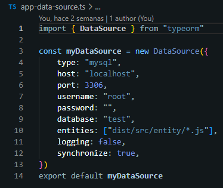
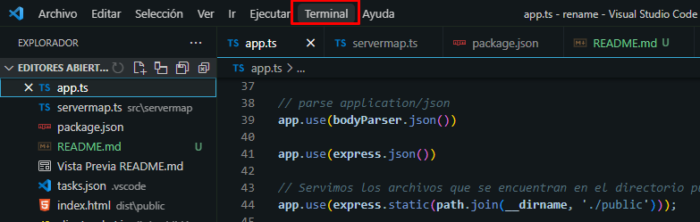
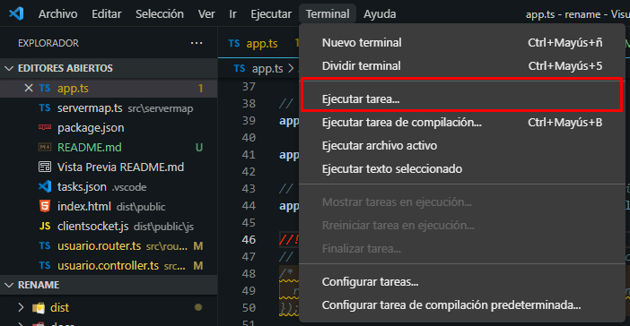
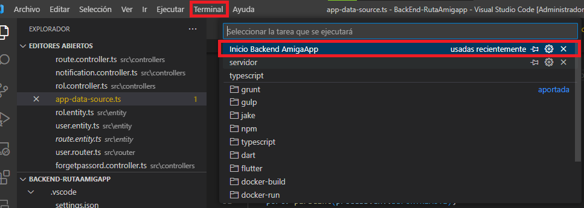
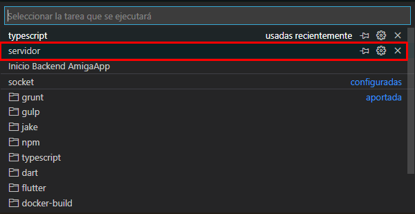
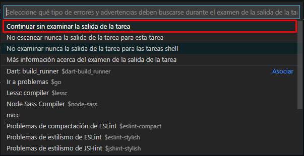
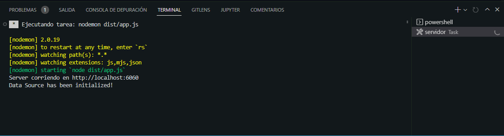

# BACKEND - RUTAMIGAPP

Configuracion inicial:


## Instalar Todas las dependencias:
```bash
  npm run install
```

<strong>NOTA:</strong> Antes de correr el proyecto verificar tener instalado las siguientes dependencias:

## Typescript:
```bash
  npm install -g typescript 
```

## Nodemon:
```bash
npm install -g nodemon
```

## Deployment:

Verificar que la aplicación xampp este corriendo, en el puerto '3006', si no tienen xampp utilicen cualquier otro gestor de db.

El archivo de configuracion de la base de datos es 'app-data-source.ts'



<strong>NOTA:</strong> Si no les corre me comentan.


## Paso 1:
Ir al menu 'Terminal':


## Paso 2:
Dar click en la opcion 'Ejecutar tarea':


## Paso 3:
Aparece esta ventana:


## Paso 4:

<strong>NOTA:</strong> Solo ejecuten el que dice 'servidor'.



## Paso 5:
Aparece esta ventana, dar clic en la opcion indicada.


## Paso 6:
Revisar que en la salida de la terminal este corriendo el servidor.

                             |